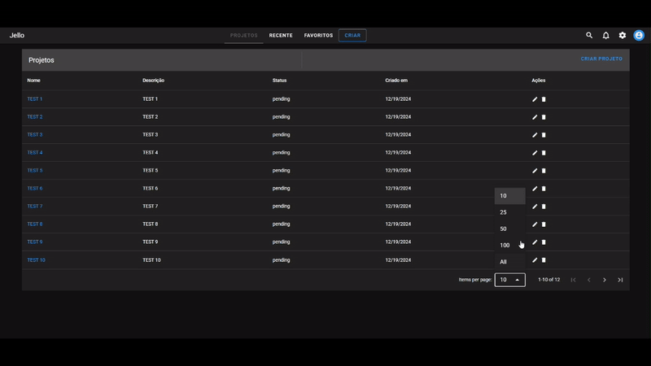
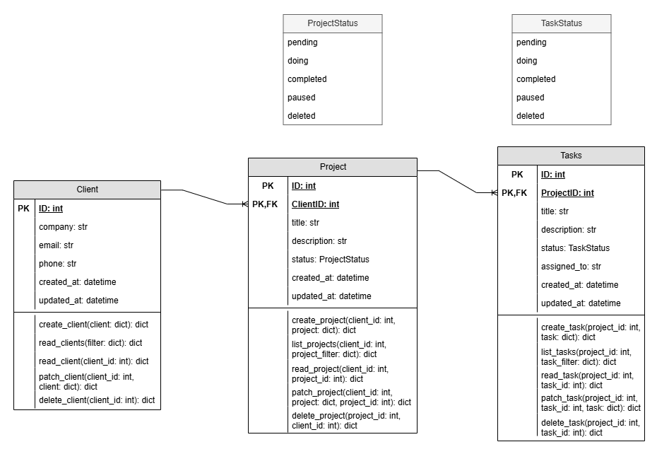

# CRUD Project

Projeto completo para gerenciar **clients**, **tasks** e **projects**, composto por um **backend** desenvolvido com **FastAPI** e um **frontend** criado com **Vue 3** e **Vuetify**.



## Estrutura
- **backend/**: Contém a API desenvolvida em FastAPI.
- **frontend/**: Contém a interface do usuário desenvolvida em Vue 3.

## Diagrama de Classes


## Como Rodar
1. **Clone o repositório**:
   ```bash
   git clone git@github.com:lele-sf/crud_project.git
    ```
2. **Siga as instruções específicas nos `README.md` dentro de cada pasta**:
- [Backend](https://github.com/lele-sf/crud_project/tree/main/crud-backend)
- [Frontend](https://github.com/lele-sf/crud_project/tree/main/crud-frontend)
